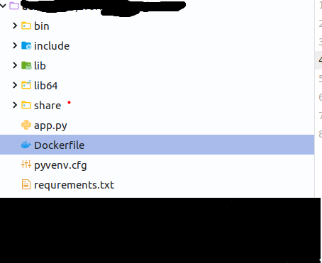
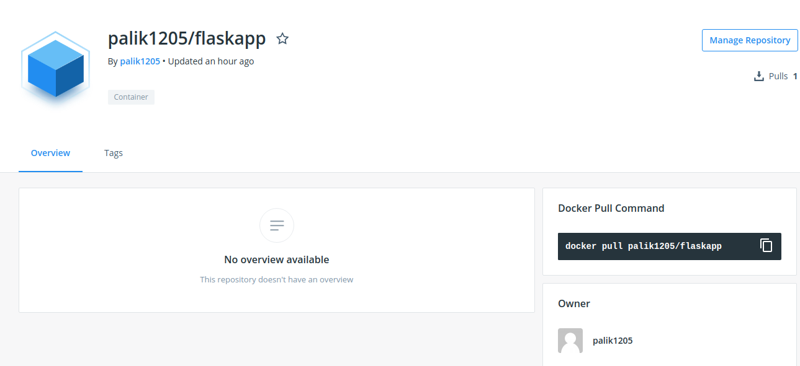

* Скачать файлы из репозитория <br />

[git тут](git@gitlab.com:palik666/test_prj.git) <br />

<br />

* Привести репозиторий к виду, как показано на скрине (у меня venv понасоздавал файлов много. по факту нужны только 3 файла:
    * app.py
    * requirements.txt
    * Dockerfile
)
<br />



* После того, как все репозиторий будет приведен к нормальному виду, необходимо избавиться от лишних зависимостей в проекте (почитайте код app.py и посмотрите на **импорты**, оптимизируйте их)

* Создайте Dockerfile! Это очень просто! (точка входа 
``` Dockerfile
CMD python3 /flask_app/app.py
```
)
* После этого хотелось бы увидеть собранный образ на докерхабе
(с тегами latest и admtest и сторокой запуска на порте 8343)

